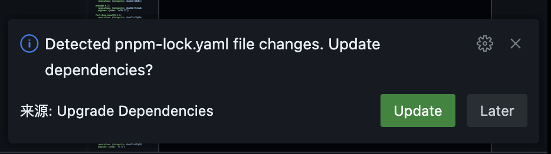
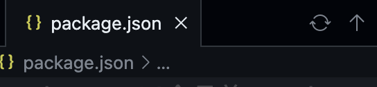

  

# Upgrade Dependencies

> Automatically detect and upgrade dependencies when lock files change

When working in a team, you may encounter issues with different dependency versions.

For example, if a team member updates dependencies and commits code, you might not realize that you need to update your dependencies, leading to code execution errors.

Upgrade Dependencies helps you automatically detect changes in dependency versions and prompts you to upgrade them.

## Features

- Automatically detects changes in lock files and prompts for dependency upgrades when changes occur

- Adds buttons for manual update and upgrade of dependencies in the top right corner of the package.json page

## Configuration

### upgradeDependencies.packageManager

- Type: `npm | yarn | pnpm`
- Default: `npm`

The package manager to use for dependency management. Supported values are `npm`, `yarn`, and `pnpm`.

### upgradeDependencies.autoUpdate

- Type: `boolean`
- Default: `false`

If set to `true`, the extension will automatically update dependencies when lock files change. If set to `false`, it will prompt you to update dependencies manually.

## Tips

### How does the extension work?

The extension compares the current lock file with the last lock file updated through the extension. If it detects any changes, it prompts you to update the dependencies.

Therefore, if you update dependencies through the terminal, the extension will not detect this change and will still prompt you to update dependencies. It is recommended to use the buttons provided by the extension to update dependencies.

### How does the extension choose which package manager to use for updates?

The extension first checks if there is only one lock file in the project. If so, it automatically selects the package manager corresponding to that lock file.

Then, it looks for the `packageManager` field in the `package.json` file to determine the package manager.

If neither of the above methods can determine the package manager, the extension will use the default package manager specified in the configuration.
